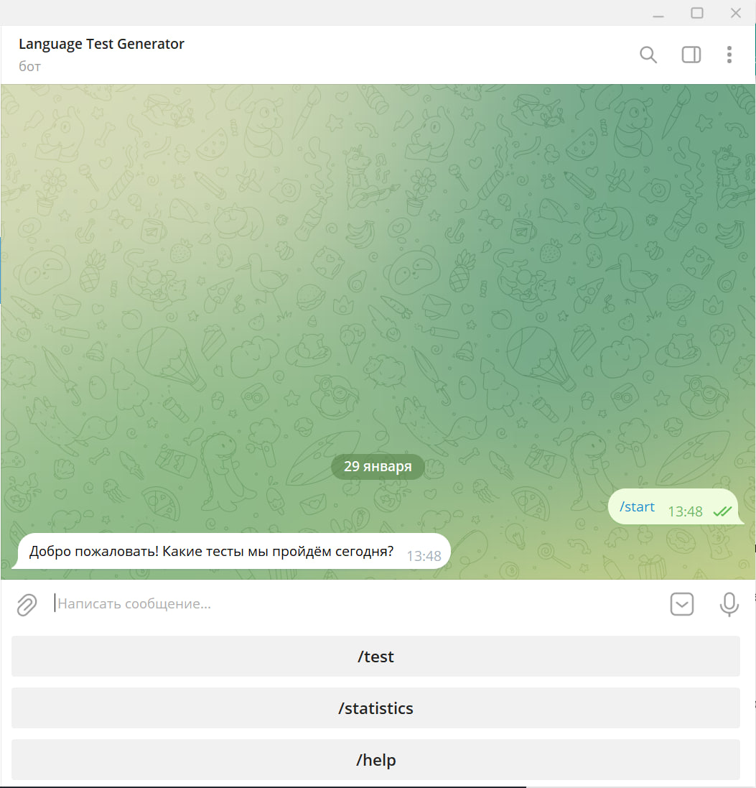

# LanguageTestBot

LanguageTestBot - квиз-бот по русскому языку, выполненный в качестве курсового проекта студентом ПМИ ФКН НИУ ВШЭ Ковалевом Кириллом.

Бот хостится тут: https://t.me/LanguageTestGeneratorBot



## Команды

`/test` - переход в режим тестирования с дальнейшей настройкой типа тестов

`/statistics` - получение пользовательской статистики

`/help` - справка по возможностям бота

## Собственная установка

Клонировать репозиторий на устройство

```
git clone https://github.com/K0valevK/LanguageTestBot.git
cd LanguageTestBot
```

Установка и запуск с использованием docker-compose

```
docker compose build
docker compose up -d
```

